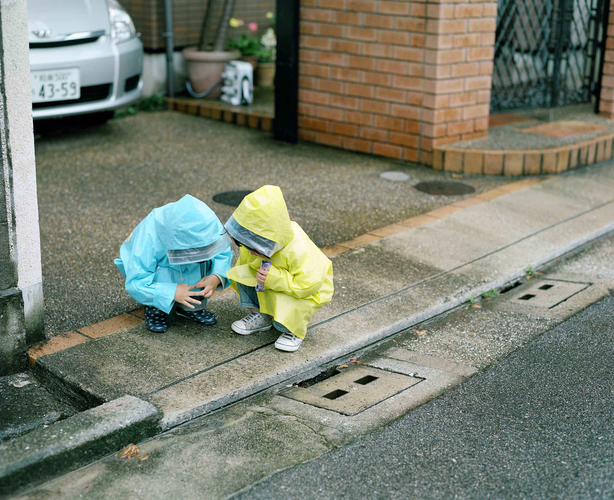
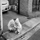
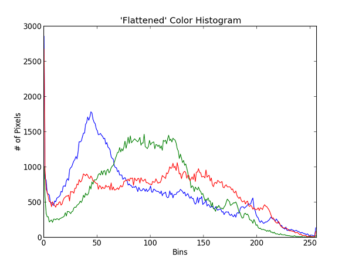
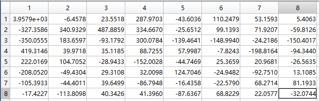

# Image hash algorithm implementation in pure Python (3.x)
---

###Requirement

[PIL](https://pypi.python.org/pypi/PIL)

---

###Original Image 

    
###Average hash   

1.  resize the image to 8 x 8 with ANTIALIAS and convert to grayscale  ('L') 

2.  calculate the average of 64 grayscales
3.  compare the 64 grayscales to the average if greater than avg get 1 else get 0
4.  convert binary to decimal integer using shift operator

**return: hash value**
> 4357514113602036515

###[color histogram hash](https://en.wikipedia.org/wiki/Color_histogram)
The formation of a color histogram is rather simple. From the definition above, we can simply count the number of pixels for each 256 scales in each of the 3 RGB channel, and plot them on 3 individual bar graphs.

In general, a color histogram is based on a certain color space, such as RGB or HSV. When we compute the pixels of different colors in an image, if the color space is large, then we can first divide the color space into certain numbers of small intervals. Each of the intervals is called a bin. This process is called color quantization. Then, by counting the number of pixels in each of the bins, we get the color histogram of the image.

Using PIL to get the image data and generate RGB color histogram.

Using four bins. Bin 0 corresponds to intensities 0-63, bin 1 is 64-127, bin 2 is 128-191, and bin 3 is 192-255.

R | G | B | Count
----|----|----|----
0|0|0|76
0|0|1|2
0|0|2|34
0|0|3|13
0|1|0|141
0|1|1|134
0|1|2|35
0|1|3|21

**return 64-dimensional vector to calculate cosine similarity**
>[18269, 70, 0, 0, 3639, 2833, 66, 0, 0, 0, 359, 16, 0, 0, 0, 0, 84....]

### Perceptive hash

1.  resize the image to 32 x 32 with ANTIALIAS and convert to grayscale  ('L') 

2.  use a discrete cosine transform (DCT) and generate the 32x32 coefficients matrix.(In fact,we only use the upper left corner,so I just generate the 8x8 coefficients matrix.)
3.  calculate the average of the matrix.
4.  compare the pixels to the average if greater than avg get 1 else get 0
5.  convert binary to decimal integer using shift operator

The returned DCT coefficients is same as the result of Matlab 'dct2' function.

    [3957.937500000001, -6.45782564328, 23.551805262031117, 287.9702588579284, -43.60357823583293, 110.2479312475327, 53.15931722426795, 5.406303839931143]
    [-327.3585995570752, 340.9328561602328, 487.88585128367384, 334.6670101433679, -25.65124783757791, 99.13930862987212, 71.92070113492402, -59.812612503827786]
    [-350.05545576158727, 183.65973191996815, -93.1792453549336, 300.0783925042408, -139.46414055118524, -148.99404374084457, -24.21862416571144, -150.40174329828017]
    [419.31459259081566, 39.971825376992214, 35.118460724579144, 88.72554147729983, 57.99868007783289, -7.824272528869479, -198.8164227675179, -94.34402138216764]
    [222.01687562677304, 104.70521732373949, -28.943253196130463, -152.00281381518312, -44.74692917448203, 25.365925196549245, 20.968129431307037, -26.563506164925084]
    [-208.0520373074981, -49.43037862161907, 29.310824116620022, 32.009755685611026, 124.70463249710798, -24.948166138795766, -92.75103158294787, 13.10849521985365]
    [-105.39332350766952, -44.401129254094535, 39.64988864697462, -86.79477136259145, -16.435764130025756, -22.578982094348916, 68.27141328357092, 81.19329683038744]
    [-17.42272275896725, -113.80984679223711, 40.342601381802034, 41.396028432989674, -87.63669517505066, 68.82287427897536, 22.057683843368007, -32.07442266899904]

